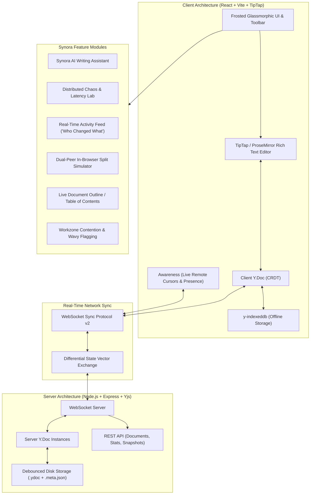

# ✨ Synora Docs — Real-Time Collaborative CRDT Document Suite

A modern, production-ready, full-stack collaborative document platform modeled after **Google Docs**, powered by **CRDTs (Yjs YATA algorithm)**, **TipTap/ProseMirror**, **WebSockets**, **IndexedDB dual-layer persistence**, **live cursor presence**, **active workzone collision detection**, and an integrated **Synora AI Writing Assistant**.

[](https://render.com)
-rose)


---

## 🌟 Key Distributed Systems & Product Features



### 1. 🔄 Conflict-Free Replicated Data Type (CRDT Engine)
- **Mathematical Convergence**: Powered by the **Yjs** engine implementing the **YATA** (Yet Another Transformation Approach) algorithm.
- **Zero Race Conditions**: Eliminates Last-Write-Wins (LWW) data loss. Edits (inserts, deletes, formatting) commute deterministically across latent and out-of-order networks.
- **Differential State Vectors**: Sync Protocol v2 exchanges compact state vectors, transmitting only incremental changes.

### 2. 👥 Live Collaborative Presence & Caret Awareness
- **Remote Cursors & Selection**: Real-time cursor coordinates with custom collaborator colors, glowing caret labels, and live selection highlights.
- **Workzone Contention Flagging**: Automatically detects when multiple peers edit at the exact same location and triggers an active hotspot warning pill with wavy underlines.
- **Collaborator Management**: Interactive collaborator modal, avatar stack with `+N` badge, and profile customizer (name, custom avatar color palette).

### 3. 💾 Dual-Layer Persistence & Network Partition Healing
- **Client Offline Storage**: Powered by `y-indexeddb`. Edits made while offline are saved locally in browser IndexedDB.
- **Server Disk Persistence**: Yjs binary document updates are debounced and persisted to `server/storage/{docName}.ydoc` and metadata to `{docName}.meta.json`. Documents survive server restarts with 100% fidelity.
- **Seamless Reconnection**: Reconnecting clients exchange missing updates automatically with zero duplicates.

### 4. 🤖 Synora AI Writing Assistant
- **Smart Actions**: Summarize document or selection, fix grammar and polish tone, expand thoughts, generate structured outlines, and insert comparison tables.
- **Collaborative Output**: AI outputs are committed into the Yjs CRDT document so all connected collaborators view the generated content in real-time.

### 5. 📑 Document Outline & Rich Formatting
- **Table of Contents Drawer**: Automatically extracts H1, H2, and H3 headings from the document with smooth click-to-jump navigation.
- **Full Typography**: Bold, italic, underline, strike, headings (H1-H3), custom text colors, highlight colors, alignments, bullet lists, numbered lists, task checklists, blockquotes, code blocks, and interactive tables.
- **Statistics Footer**: Live word count, character count, and estimated reading time.
- **Multi-Format Export**: 1-click export to Markdown (`.md`), HTML (`.html`), and PDF / Print (`Ctrl+P`).

### 6. 🧪 Distributed Chaos & Evaluation Lab
- **Dual-Peer Simulator**: Side-by-side split screen running two isolated collaborative peers in the same browser window for immediate live testing of simultaneous typing and cursor tracking.
- **Chaos Panel**:
  - Network severance simulator (simulate offline mode & test partition healing).
  - Artificial latency slider (0ms - 2000ms).
  - 25 concurrent out-of-order race condition stress tester.
  - Real-time CRDT telemetry: encoded byte size, clock states, awareness peer count.

---

## 🚀 Quick Start Guide

### Prerequisites
- Node.js LTS (v18+ or v20+ / v22+)
- npm or yarn

### 1. Local Development Setup

```bash
# Clone the repository
git clone https://github.com/tannmmyy/synora-docs.git
cd synora-docs

# Install dependencies for both server and client
npm run build

# Start both Server & Client
# In Terminal 1 (Server on http://localhost:3000 and ws://localhost:3000):
npm --prefix server run dev

# In Terminal 2 (Client on http://localhost:5173):
npm --prefix client run dev
```

---

## ☁️ Deploying to Render in 1 Click

1. Push this repository to your GitHub account (`synora-docs` or `google-docs-crdt`).
2. Log into [Render.com](https://render.com).
3. Click **New +** → **Web Service**.
4. Connect your GitHub repository.
5. Configure the service settings:
   - **Environment**: `Node`
   - **Build Command**: `npm run build`
   - **Start Command**: `npm start`
   - **Plan**: `Free`
6. Click **Deploy Web Service**!
   - Render will build the client and server and serve both the WebSocket CRDT engine and the frontend web app on a single unified HTTPS/WSS URL (e.g. `https://synora-docs.onrender.com`).

---

## 🧪 Testing & Verification

### 1. Automated CRDT Convergence Test
Verifies out-of-order edits, partition healing, and 100 concurrent mutations:
```bash
npm run test:crdt
```

### 2. Multi-Peer Live Stress Test
Simulates multiple concurrent WebSocket clients typing simultaneously:
```bash
npm --prefix server run test:collab
```

### 3. Dual-Peer In-Browser Split Test
- Open `http://localhost:3000` (or your Render URL).
- Click **"Dual Peer Test"** in the top header.
- Type in Peer 1 and observe live character synchronization and caret movement in Peer 2.

### 4. Partition Healing Test
- Click **"Chaos & CRDT"** in the top header.
- Click **"Simulate Network Cut (Go Offline)"** on Peer 1.
- Type in Peer 1 while disconnected; type something else in Peer 2.
- Click **"Heal Partition (Reconnect & Sync)"**.
- Both streams will merge deterministically with zero data loss.

---

## 📡 REST API Reference

| Endpoint | Method | Description |
| :--- | :--- | :--- |
| `/api/health` | `GET` | Health check & service status |
| `/api/network-info` | `GET` | Returns local LAN IP and WebSocket URLs |
| `/api/documents` | `GET` | Lists all persisted collaborative documents |
| `/api/documents` | `POST` | Creates a new document room with metadata |
| `/api/documents/:id/metadata` | `GET` | Retrieves document title and timestamps |
| `/api/documents/:id/metadata` | `PATCH` | Updates document title |
| `/api/documents/:id/stats` | `GET` | Returns CRDT byte size, connected clients & updates |

---

## 📄 License
MIT © Tanmoy Ghosh
